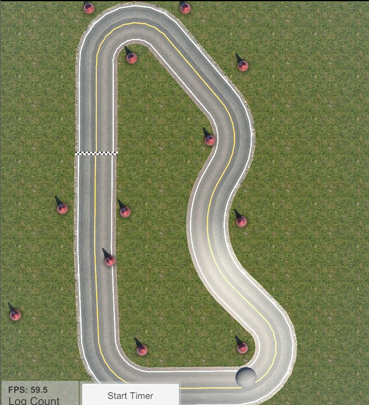

# donkeycar-rl
This project investigates teaching the Donkey car to drive a simulated road or track using State Representation Learning and different Reinforcement Learning Algorithms including Deep Q-Network, Soft Actor-Critic and Proximal Policy Optimization Algorithms.

## Overview
There are two distinct phases in this autonomous driving pipeline: scene understanding and decision-making and control.

State Representation Learning (SRL) is a subset of under scene understanding, while vehicle control falls under the heading of decision making and control.

## Structure

### State Representation Learning

The State Representation Learning code is all within the autoencoder folder. In this project, an Autoencoder (AE)
and Variational Autoencoder (VAE) are used to compress the input image through a bottleneck such that the latent representation is a lower-dimensional representation of the original
image.

This lower-dimensionality allows the training of the agent controlling the Donkey car to be much faster and less computationally expensive than training
on raw images. Images are collected while manually driving the physical or simulated Donkey car. Training and validation occur offline using these collected images. 

For more details see the [readme](autoencoder/README.md) in the autoencoder folder.

#### Raw Simulator Image Examples


Before training in either the AE or the VAE, the images had Gaussian noise
added in an attempt to reduce over-fitting. They are also cropped at the horizon
as this adds little value.noisy


#### Denoising Autoencoder Output

Reconstructed images using the AE of the road at different steps in
training


#### Variational Autoencoder Output

Reconstructed images of the track using the VAE at different steps
in training


## Vehicle Control
Before experimentation could proceed, a training pipeline was created to connect the donkey car in the simulator to the AE, VAE and the RL algorithms.

Running any of the training-*.py files launches the donkey car simulator, initializes the RL algorithm's with hyperparameters and starts training. Training data is saved in Tensorbaord.

Example commands to run the code:

```python train_sac.py --environment_id=donkey-generated-track-v0 --ae_path=trained-models/track/vae-64_1630154104_best.pkl```

```python train-ppo-with-eval.py --environment_id=donkey-generated-track-v0 --ae_path=trained-models/track/vae-64_1630154104_best.pkl```

### Rewards

Within this project, good performance is defined as driving fast on the road or track. A custom reward python file was created with different reward functions.
The donkeysim class has a setrewardfn method that allows custom rewards to be injected.

Different values for the parameters were tested while running experiments. All the reward functions include a multiplier that yields the best
result when driving in the centre of the lane.

1. Reward 1: Included in the [simulator](https://docs.donkeycar.com/guide/simulator/). Returns a Negative
   reward for crashing. A positive reward of one multiplied by the car speed
   returned at every step.
2. Reward2: Returns a Negative reward for crashing, weighted by average
   throttle at the time of the crash. A reward is returned every step which is
   weighted by the average throttle amount.
3. Reward 3: Returns a Negative reward for crashing, weighted by the last
   throttle amount ([learning-to-drive-smoothly-in-minutes](https://towardsdatascience.com/learning-to-drive-smoothly-in-minutes-450a7cdb35f4)). A reward is returned every step which is
   weighted by the last throttle amount.
   
Smooth driving leads to better driving performance, so a sub-goal that rewards smooth driving is used to encourage this behaviour. The experiments use two different reward functions for steering behaviour.

1. SmoothSteeringWithThresholdReward: reduces the reward if the steering
   angle is outside a steering threshold.
2. NormalDistributionSteeringReward: uses a normal distribution and reduces
   the reward the further the steering angle moves from zero (Winder, 2020).
3. SmoothSteeringwithMovingAverage: a transformer wrapper the constrains
   the steering on a moving average of three previous steering angles.

### Algorithm's

### Deep Q-Network

The first algorithm trialled was a DQN based on the example from deep mind for the Atari challenges (Lapan, 2020). The observation state space was discretized
into 15 buckets. The algorithm was unstable during training and while running a policy.


DQN model collapses getting stuck in local optima during training as epsilon decreases

### Soft Actor-Critic

The second set of experiments used the Soft Actor-Critic (SAC) algorithm, specifically the implementation from [Stable-Baselines3](https://stable-baselines.readthedocs.io/en/master/modules/sac.html). 
The hyperparameters used were those found using [RL Baselines3 Zoo](https://github.com/DLR-RM/rl-baselines3-zoo) optimisation scripts. 
Larger batch sizes were also tested, but the models were not as stable. However, changes in hyperparameters had a much smaller impact on performance than changes to the reward function.

Initially, all experiments were done on the road as it was a simpler environment. Once it was validated the policy could traverse the randomly
generated road, experimentation moved to the track.

#### Example track


#### Training 

To facilitate training and evaluation a Python file was created that trained a model for 50,000 timeseteps. The model was then saved and reloaded and ten
evaluation episodes were run. The lap-times were logged and in some cases a screenshot taken.

A series of experiments were run using different transformation wrappers. The most successful transformations were kept and modifications were made to the primary and
secondary reward functions. Parameters for throttle and steering reward were incrementally adjusted.

Using this method, training time was reduced from approximately five hours to twenty minutes, and the lap times reduced from 580 to 26 seconds.


The trained SAC model was also very stable as shown below.


#### Lap times

Track lap times with different reward combinations


## Proximal Policy Optimization

It took longer to successfully train a model with the PPO algorithm and the policies created would veer of the track more often than
those trained with the SAC algorithm. Training was only successful with the more conservative average throttle reward and normally distributed steering
weight. However, when successful the car tended to be faster than the SAC model.

ToDo: Add screen shots

## Related Projects
A while ago I discovered the [Donkey car](https://www.donkeycar.com/) project, an opensource DIY self driving platform for small scale cars.
I built and trained the Donkey car using Behavioral Cloning.

 


I had also discoved the [World Models](https://worldmodels.github.io/) project by David Ha and Jürgen Schmidhuber. This included a section on "Car Racing Experiment: World Model for Feature Extraction". 
These ideas were further expanded on by David Foster in "Generative deep learning: teaching machines to paint, write,
compose, and play" by O'Reilly. 

I wanted to apply these ideas to training the Donkey car.

I then came across [Donkeycar reinforcement learning](https://github.com/flyyufelix/donkey_rl/) by Felix Yu 
and [Learning to drive smoothly in minutes](https://github.com/araffin/learning-to-drive-in-5-minutes/) by Antonin Raffin.
Both these projects used the [Donkey car simulator](https://docs.donkeycar.com/guide/simulator/) by Tawn Kramer.

Finally, I read [Reinforcement Learning](https://rl-book.com/) by Phil Winder which contained a chapter on Autonomous Driving using the Donkey car as an example of a complex RL problem. This was based on AAntonin Raffin's project.

Using all these resources as a baseline I used [Stable-Baselines3](https://stable-baselines3.readthedocs.io/en/master/) also by Antonin Raffin to train an agent to drive the track.

#### SRL Issues

One unexpected issue encountered when using the AE or VAE with the algorithm’s for vehicle control was that the agent would take different driving
lines during exploration. These were areas of the track a human driver would try and avoid. As manually driving the courses captured the training data, this
left some areas of the track underrepresented.

As a result, the latent representation was just noise. Consequently, the Donkey car would drastically slow or come to a stop in these sections of the track. These areas were identified
after writing the DonkeyViewWrapper, which displayed the decoded image while driving using a Pygame window. More images were collected, and the VAE retrained with a larger dataset.

#### Contol Issues

Initially, the agent learnt a policy of driving in circles as a way of maximising reward. The maximum CTE value was too large, allowing the agent to complete
a full rotation without hitting the done criteria and to collect reward indefinitely.

The first attempt to overcome this issue was to reduce the CTE value to constrain the bounds within which the car could operate and was partially successful.

The next issue occurred when the wiring of the AE had a bug. The agent was effectively driving blind. In this situation, the agent learned to drive as
slowly as possible to maximise the reward before disqualification for going out of bounds and receiving a crash penalty. 

A third issue occurred because of a bug that incremented the steering reward even if no throttle signal was present. 
The agent learned to constantly change steering angle while stationary.

Some time was lost at this stage before the DonkeyViewWrapper presented the agent view. It showed a decoded view of the latent representation. Fixing the
bugs allowed the car to make progress down the track. The DonkeyViewWrapper also highlighted an issue where the agent did not get an observation from the
environment for two time steps after the car was launched. Throttle amount was set to a very small value until the agent received an observation.

## ToDo
- Implement the SAC and PPO algorithms from scratch
- Train the physical Donkey car


