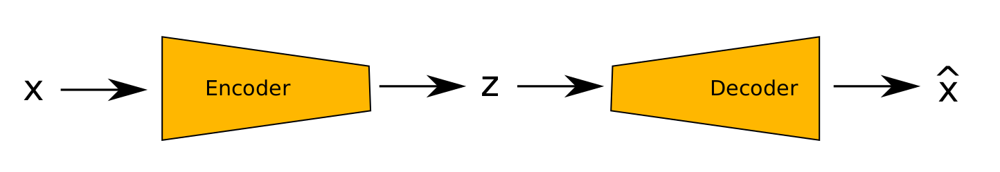

# Autoencoder
An Autoencoder (AE) is an example of an unsupervised learning algorithm. An AE is not trying to predict something from the input data. Instead, it
learns a compressed representation of the input training data that allows it to reproduce its input. AEs can also be used to generate new instances of training
data.

This is useful as the AE learns a dense representation, with lower dimensionality, of the input data called the latent representation.

As demonstrated in the diagram below, an AE consists of two distinct components, an encoder and a decoder.

The encoder takes an input (x) and outputs a low-dimensional representation of that input (z). A decoder that takes the low-dimensional representation (z), and reconstructs the input (x̂).



If an AE does this reconstruction perfectly, then: x = x̂ 

AEs can also be feature detectors. In this project, they are used to detect road markings.

In this project I experimented with both a Denoising Autoencoder and Variational Autoencoder(VAE). The main difference between the two is the VAE assumes that the source data has some underlying probability distribution such as a Gaussian distribution.

"The parameters of a VAE are trained via two loss functions: a reconstruction loss that forces the decoded samples to match
the initial inputs, and a regularization loss that helps learn well-formed latent spaces and reduce overfitting to the training
data." - Chollet.

## Training
To train the AR or VAE using the imcluded images run:

```python train_autoencoder.py --folders=images/road/val/road```

```python train_vae.py --folders=images/track/val```


### Training Note
All training was carried out on a 2016 HP Z book Gen 3 with a 2 GB NVIDIA Quadro M1000M GPU. The laptop was running Ubuntu 20.04, and the code was
written in Python, using PyTorch and CUDA 10.2. The GPU was adequate for training the 32-bit AE and the donkey simulator; however, it was too small to
train the VAE with 64-bit latent space and run out of memory.

It took 14 hours to train the VAE using the CPU for 200 episodes, so Google Colaboratory was used instead. On Colab, the VAE took approximately four
hours for 200 episodes of training. All the code and the Jupiter notebooks are in the GitHub repository listed in the appendix.

Later it was discovered that more samples had to be added to account for agent exploration and 300 training episodes were required. This was not possible
on Colaboratory as training time exceeded GPU usage. Instead a cloud server from Datacrunch.io with 1x NVidia Tesla V100 was used. Training on this server took two hours.

## Model Architectures

### Autoencoder Architecture

```
Autoencoder(
    (encoder): Sequential(
        (0): Conv2d(3, 32, kernel size=(4, 4), stride=(2, 2))
        (1): ReLU()
        (2): Conv2d(32, 64, kernel size=(4, 4), stride=(2, 2))
        (3): ReLU()
        (4): Conv2d(64, 128, kernel size=(4, 4), stride=(2, 2))
        (5): ReLU()
        (6): Conv2d(128, 256, kernel size=(4, 4), stride=(2, 2))
        (7): ReLU()
        (8): Flatten(start dim=1, end dim=-1)
    )
    (encode linear): Linear(in features=6144, out features=32, bias=True)
    (decode linear): Linear(in features=32, out features=6144, bias=True)
    (decoder): Sequential(
        (0): ConvTranspose2d(256, 128, kernel size=(4, 4), stride=(2, 2))
        (1): ReLU()
        (2): ConvTranspose2d(128, 64, kernel size=(4, 4), stride=(2, 2))
        (3): ReLU()
        (4): ConvTranspose2d(64, 32, kernel size=(5, 5), stride=(2, 2))
        (5): ReLU()
        (6): ConvTranspose2d(32, 3, kernel size=(4, 4), stride=(2, 2))
        (7): Sigmoid()
    )
)
```

#### Variational Autoencoder Architecture

```
VAE(
    (encoder): Sequential(
        (0): Conv2d(3, 64, kernel size=(4, 4), stride=(2, 2))
        (1): ReLU()
        (2): Conv2d(64, 128, kernel size=(4, 4), stride=(2, 2))
        (3): ReLU()
        (4): Conv2d(128, 256, kernel size=(4, 4), stride=(2, 2))
        (5): ReLU()
        Conv2d(256, 512, kernel size=(4, 4), stride=(2, 2))
        (7): ReLU()
        (8): Flatten(start dim=1, end dim=-1)
    )
    (fc1): Linear(in features=12288, out features=64, bias=True)
    (fc2): Linear(in features=12288, out features=64, bias=True)
    (fc3): Linear(in features=64, out features=12288, bias=True)
    (decoder): Sequential(
        (0): ConvTranspose2d(512, 256, kernel size=(4, 4), stride=(2, 2))
        (1): ReLU()
        (2): ConvTranspose2d(256, 128, kernel size=(4, 4), stride=(2, 2))
        (3): ReLU()
        (4): ConvTranspose2d(128, 64, kernel size=(5, 5), stride=(2, 2))
        (5): ReLU()
        (6): ConvTranspose2d(64, 3, kernel size=(4, 4), stride=(2, 2))
        (7): Sigmoid()
    )
)
```
